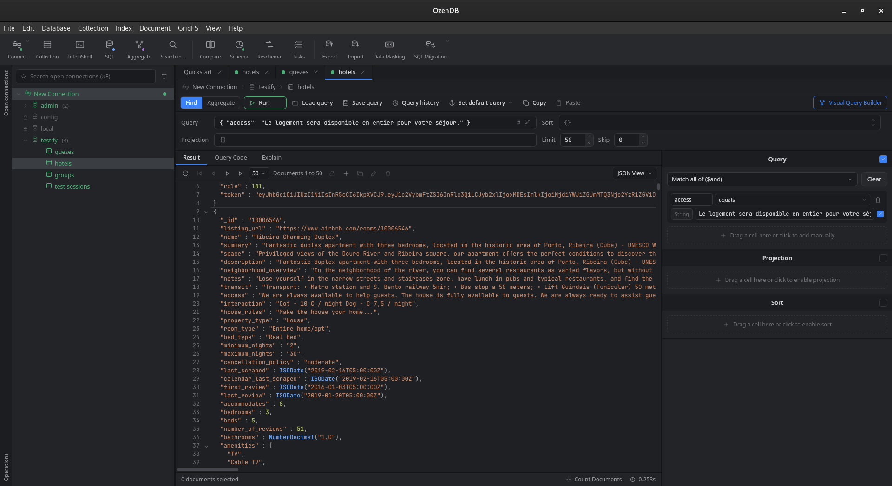

# OzenDB

An open-source, free alternative to [Studio-3T](https://studio3t.com/) — a desktop GUI for managing MongoDB. Built with [Tauri](https://tauri.app/) (Rust backend) and [Vue.js](https://vuejs.org/) (front-end). Still a work in progress.

# Contents

- [Why?](#why)
- [Prerequisites](#prerequisites)
- [Installation](#installation)
- [Roadmap](#roadmap)
- [Want to Contribute?](#want-to-contribute)

### Why?
I really love Studio-3T however the features I really like are only included in their subscription models(Basic/Pro/Ultimate). And I have tried to find comparable open-source alternative to Studio-3T, surprisingly, I have not found anything. And that is the reason why I am developing OzenDB in order to give back to community. When I started this project, I wanted to learn Rust because - 'why not?'. And I have a specific problem and the technology I want to learn. Bingo! 

I wanted a tool that is (plus what Studio-3T provides):
- Open-source and free.
- Light-weight, with a fast startup time.
- Not buggy (on my Fedora work laptop with a multi-monitor setup, Studio-3T very often just freezes without any feedback).
- More customizable.

`OzenDB` will check all of those boxes in the future for me.

### Prerequisites

---
If you just want to **run** OzenDB, you only need the note below — grab a pre-built binary from [Installation](#installation), no toolchain required.

- On Linux, password storage uses the Secret Service API, so a provider such as `gnome-keyring` (or KWallet) must be installed and running — otherwise saved passwords won't persist between restarts. This is typically already present on GNOME/KDE desktops.

To **build from source**, you additionally need:

1) The platform-specific system dependencies from the [Tauri prerequisites](https://tauri.app/start/prerequisites/) guide. They have awesome guides for major platforms (kudos!).
2) `rust` and `node` installed. [Instructions](https://tauri.app/start/prerequisites/#rust).

### Installation

---
#### Download a pre-built binary (recommended)

Grab the latest build for your platform from the [Releases page](https://github.com/AqilbekAbilaev/ozendb/releases/latest):

- **macOS** — `OzenDB_*_universal.dmg` (Intel + Apple Silicon). Open it and drag OzenDB into Applications.
- **Windows** — `OzenDB_*_x64-setup.exe` (installer) or `OzenDB_*_x64_en-US.msi`. Run it and follow the prompts.
- **Linux** — `OzenDB_*_amd64.AppImage` (portable — `chmod +x` then run), `OzenDB_*_amd64.deb` (Debian/Ubuntu), or `OzenDB-*.x86_64.rpm` (Fedora/RHEL).

> **Heads-up for macOS and Windows users:** these builds are **not yet code-signed or notarized**, so the OS will warn you that OzenDB is from an unidentified developer and may block it on first launch. This is expected — it's a policy about signing, not a problem with the app itself.
> - **macOS (Gatekeeper):** right-click the app → **Open** → **Open** again, or run `xattr -dr com.apple.quarantine /Applications/OzenDB.app`.
> - **Windows (SmartScreen):** click **More info** → **Run anyway** on the blue warning dialog.

#### Build from source

For development, or if there's no binary for your platform, see [Prerequisites](#prerequisites) then:

1) `npm install`
2) `npm run tauri dev` and the window should pop up.

### Roadmap

The current status, what's done, and what's planned all live in [ROADMAP.md](ROADMAP.md).

### Want to Contribute?

---
Contributions are very welcome — this is a learning project as much as a tool. Good places to start are the open items in [ROADMAP.md](ROADMAP.md). Feel free to open an issue to discuss an idea or report a bug, or send a pull request. Build and run instructions are in [Installation](#installation) above.
