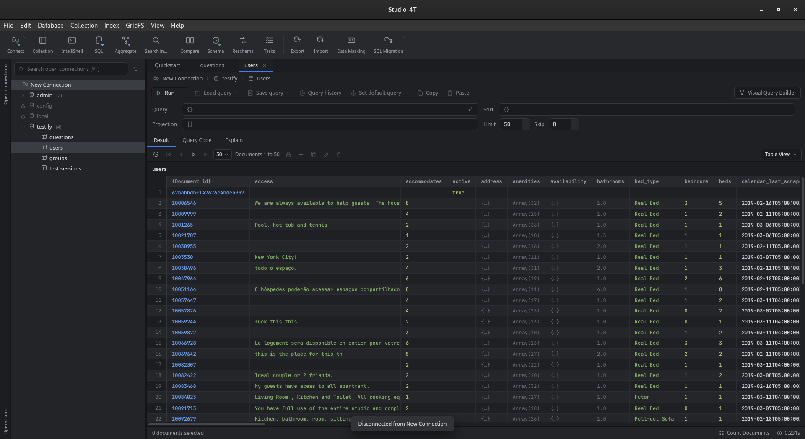

# Studio-4T

An open-source, free alternative to [Studio-3T](https://studio3t.com/) — a desktop GUI for managing MongoDB. Built with [Tauri](https://tauri.app/) (Rust backend) and [Vue.js](https://vuejs.org/) (front-end). Still a work in progress, but it can already connect, browse, query, and edit documents.

# Contents

- [Why?](#why)
- [Features](#features)
- [Prerequisites](#prerequisites)
- [Installation](#installation)
- [Roadmap](#roadmap)
- [Want to Contribute?](#want-to-contribute)

### Why?
I really love Studio-3T however the features I really like are only included in their subscription models(Basic/Pro/Ultimate). And I have tried to find comparable open-source alternative to Studio-3T, surprisingly, I have not found anything. And that is the reason why I am developing Studio-4T in order to give back to community. When I started this project, I wanted to learn Rust because - 'why not?'. And I have a specific problem and the technology I want to learn. Bingo! 

I wanted a tool that is (plus what Studio-3T provides):
- Open-source and free.
- Light-weight, with a fast startup time.
- Not buggy (on my Fedora work laptop with a multi-monitor setup, Studio-3T very often just freezes without any feedback).
- More customizable.

`Studio-4T` will check all of those boxes in the future for me.

### Features

Today MongoDB is the only supported database, but the long-term goal is to support more.

What works right now:

- **Connections** — a Connection Manager to create, edit, and delete connections, with a dialog for the individual fields (host/port, replica set, auth source and **auth mechanism**) and a live "Test Connection" check. Connections are color-tagged and persisted to disk so they survive restarts.
- **Secure password storage** — passwords are kept in the OS keychain (Secret Service on Linux, Keychain on macOS, Credential Manager on Windows), never written to the connections file on disk.
- **Connection tree** — a collapsible Connection → Database → Collection sidebar that loads data on expand, with a context menu (open collection, copy name, disconnect, refresh, …).
- **Query workspace** — multiple tabs, each bound to a collection. A query bar with filter / sort / projection / skip / limit fields (syntax-highlighted JSON), `Ctrl/Cmd+Enter` to run, and result paging (first/prev/next/last + page-size picker).
- **Viewing results** — Table View and JSON View, a "Query Code" tab that shows the equivalent `db.collection.find(...)` shell command, inline cell editing, and drill-down into nested objects and arrays with a breadcrumb path.
- **Document editing** — insert, edit/replace, and delete documents; copy a value/row/document to the clipboard.
- **Collection & database actions** — create a collection and drop a database, wired through the tree.

Under the hood: an async connection pool (one client per connection, reused across operations), a fast TCP probe for instant "connection refused" feedback, and a Rust backend covered by unit tests.

See [ROADMAP.md](ROADMAP.md) for the full, up-to-date status and what's coming next (Tree View, Explain, visual query builder, index management, import/export, GridFS, IntelliShell, and more).

### Prerequisites

---
1) First of all, please follow instructions [tauri prerequisites](https://tauri.app/start/prerequisites/) and make sure that you have installed platform-specific system dependencies. They have awesome guides for major platforms (kudos!).
2) Make sure that you have installed `rust` and `node`. [Instructions](https://tauri.app/start/prerequisites/#rust).
3) On Linux, password storage uses the Secret Service API, so a provider such as `gnome-keyring` (or KWallet) must be installed and running — otherwise saved passwords won't persist between restarts. This is typically already present on GNOME/KDE desktops.

### Installation

---
Currently there are not any pre-built binaries which you just download and run. I am going to release binaries when I finish implementing basic database manager functionalities. So for now you have to build your own ones in order to test it :).

In order to locally build: 

1) `npm install`
2) `npm run tauri dev` and the window should pop up.

### Roadmap

The current status, what's done, and what's planned all live in [ROADMAP.md](ROADMAP.md).

### Want to Contribute?

---
Contributions are very welcome — this is a learning project as much as a tool. Good places to start are the open items in [ROADMAP.md](ROADMAP.md). Feel free to open an issue to discuss an idea or report a bug, or send a pull request. Build and run instructions are in [Installation](#installation) above.
